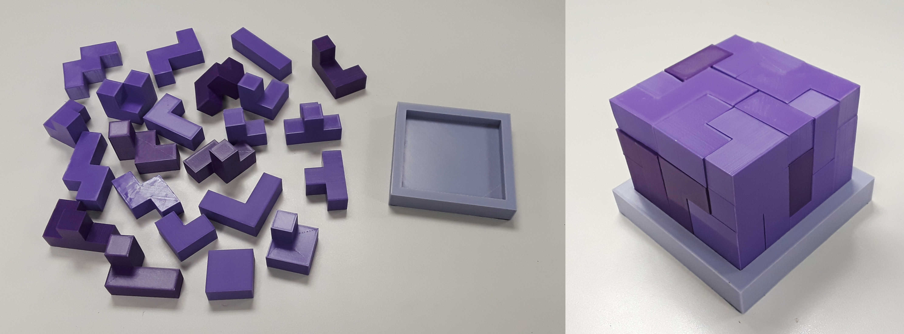

# Polycube
A solver of polycube packing puzzles, such as the one below:



## Usage

```
polycube [-c] [-n SOLUTIONLIMIT] [-p PRINTLIMIT] PUZZLEFILE
```

where `PUZZLEFILE` is the file containing the puzzle specification.

### Flags

`-c`: output solutions with color (not supported on all terminals)

`-n SOLUTIONLIMIT`: stop counting solutions at `SOLUTIONLIMIT`, enter a nonpositive number for infinity, default is 100

`-p PRINTLIMIT`: print no more than `PRINTLIMIT` solutions, default is 10

## Puzzle Specification

For examples of puzzle specifications, see `./dat/`.

Files which are used to specify polycubes should end in `.cubes`. Puzzle files should end in `.brick`. Such files are divided by hashtags (`#`) into sections.

The first section is imports. Each line should be a file name, leading to another puzzle specification. From each file, import the first two sections (imports and polycubes). Imports are recursive, and no file is imported twice.

The second section is polycubes. Each polycube begins with a line containing the name, which must be alphanumeric. Polycube names are case-insensitive. Following is the 3D representation of the polycube (where `.` means empty and every other non-whitespace character means full) and a blank line. The left-most layer in the representation is the top layer.

The third section is the board specification: 3 integers specifying the length, depth, and height of the puzzle, in that order, followed by an optional integer, `k`, specifying the tilting constraint. That is, no polycube may horizontally slide off the board unless some part of it resides on one of the bottom `k` layers. If `k` is not specified, it defaults to height.

The fourth section specifies the polycubes used in the puzzle: a whitespace separated list of polycube names.

Files which are imported must have at least 2 sections, while puzzle files must have at least 4.
